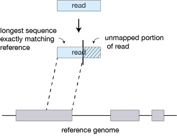
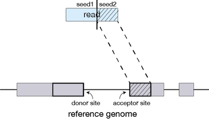

Approximate time: 20 minutes

### STAR Alignment Strategy

STAR is shown to have high accuracy and outperforms other aligners by more than a factor of 50 in mapping speed, but it is memory intensive. The algorithm achieves this highly efficient mapping by performing a two-step process:

1. Seed searching
2. Clustering, stitching, and scoring

#### Seed searching

For every read that STAR aligns, STAR will search for the longest sequence that exactly matches one or more locations on the reference genome. These longest matching sequences are called the Maximal Mappable Prefixes (MMPs):

	
The different parts of the read that are mapped separately are called 'seeds'. So the first MMP that is mapped to the genome is called *seed1*.

STAR will then search again for only the unmapped portion of the read to find the next longest sequence that exactly matches the reference genome, or the next MMP, which will be *seed2*. 

This sequential searching of only the unmapped portions of reads underlies the efficiency of the STAR algorithm. STAR uses an uncompressed suffix array (SA) to efficiently search for the MMPs, this allows for quick searching against even the largest reference genomes. Other slower aligners use algorithms that often search for the entire read sequence before splitting reads and performing iterative rounds of mapping.

**If STAR does not find an exact matching sequence** for each part of the read due to mismatches or indels, the previous MMPs will be extended.

**If extension does not give a good alignment**, then the poor quality or adapter sequence (or other contaminating sequence) will be soft clipped.

#### Clustering, stitching, and scoring

The separate seeds are stitched together to create a complete read by first clustering the seeds together based on proximity to a set of 'anchor' seeds, or seeds that are not multi-mapping.

Then the seeds are stitched together based on the best alignment for the read (scoring based on mismatches, indels, gaps, etc.). 

---
*This lesson has been developed by members of the teaching team at the [Harvard Chan Bioinformatics Core (HBC)](http://bioinformatics.sph.harvard.edu/). These are open access materials distributed under the terms of the [Creative Commons Attribution license](https://creativecommons.org/licenses/by/4.0/) (CC BY 4.0), which permits unrestricted use, distribution, and reproduction in any medium, provided the original author and source are credited.*
